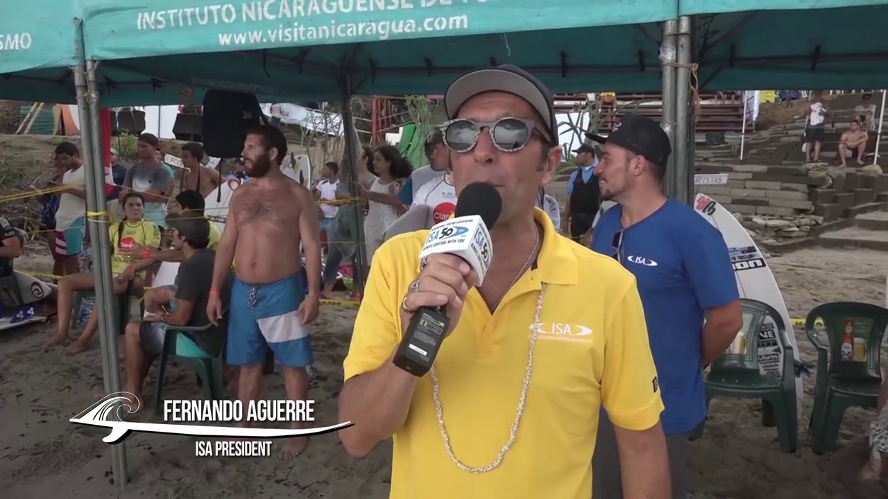
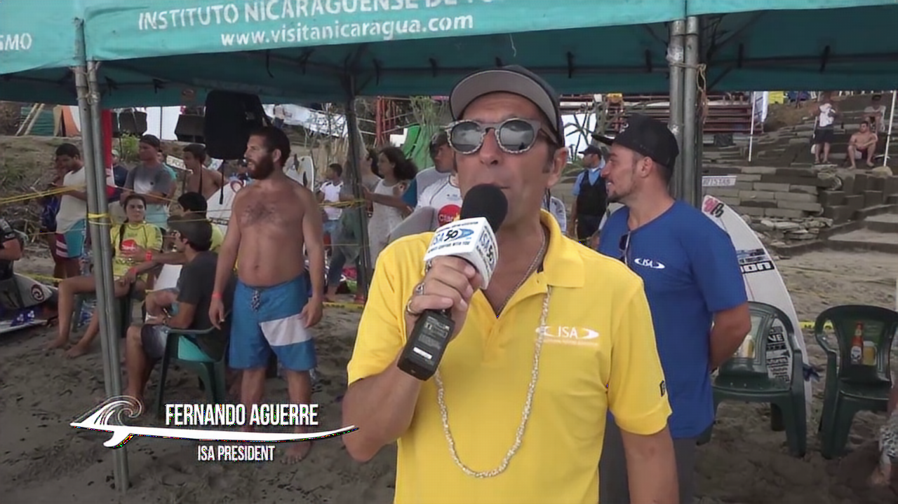
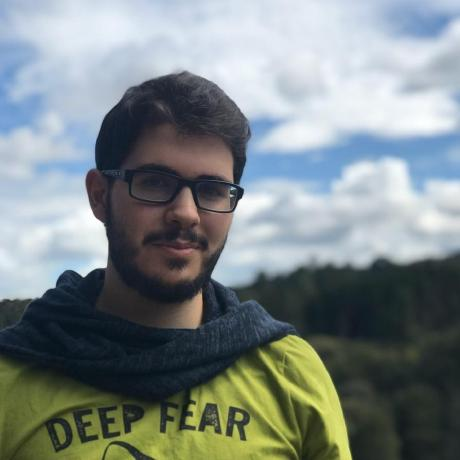

# Lossy image compression using compressive autoencoders
## Train
You can train a new custom model by executing the following command.
You can provide any images dataset that you want. For now, dataset must contain *720x1280* images.
This will probably be expanded in the future.
```bash
python3 src/train.py \
  --output-path trained_models \
  --dataset-path test.bmp \
  --log-freq 5 \
  --save-freq 15
```
## Test
You can test a trained model by executing the following command.

`trained_models` should be that folder containing the model.
```bash
python3 src/test.py \
  --model-path trained_models \
  --image-path test.bmp
```
## Results

| Original             |  Result |
:-------------------------:|:-------------------------:
2.8 MB  | 1.2 MB 
631 KB  | 21 KB 
787 KB  | 38 KB 

## References
- [1] [DeepZip: Lossless Compression using Recurrent Networks](https://web.stanford.edu/class/archive/cs/cs224n/cs224n.1174/reports/2761006.pdf)
- [2] [Lossy Image Compression with Compressive Autoencoders, Theis et al.](https://arxiv.org/abs/1703.00395)
- [3] [Variable Rate Image Compression with Recurrent Neural Networks, Toderici et al.](http://arxiv.org/abs/1511.06085)